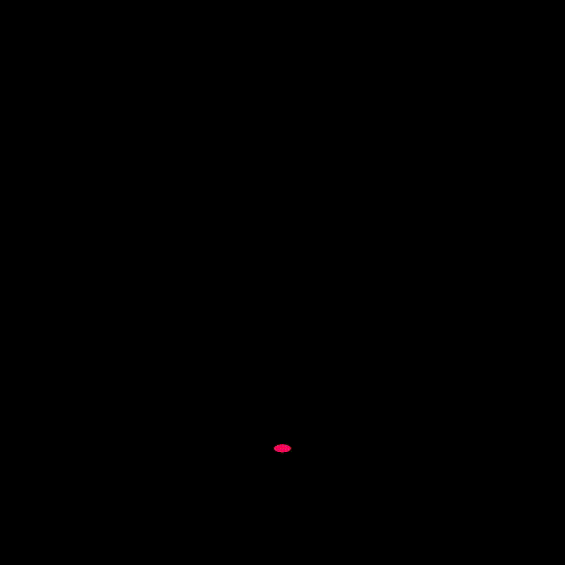

# maniflow - A Python library for geometric processing

The purpose of this library is to provide tools for the study of the most beautiful discipline of mathematics: 
geometry and geometric analysis. In doing so, we restrict ourselves to 2-manifolds. For a mathematician, 
this may initially seem like a major restriction. However, it allows us, in a relatively simple way, 
to represent 2-manifolds as 'meshes' and to develop powerful tools to study them. 
The abstraction hardly needs to be restricted at all, because the proposed calculus for meshes makes it possible to 
develop new geometries with comparatively little effort. Properties of these meshes can then be examined using 
maniflow. For example, we provide tools to break down meshes into their connected components. You can also use 
maniflow to determine the orientability of a mesh. It is also possible to run a geometric flow, such as the mean 
curvature flow, on a mesh. This means that maniflow can also be used to examine meshes with regard to curvature 
(Gaussian curvature, mean curvature).
maniflow also provides the option of creating images of the meshes. This makes it possible, for example, 
to create animations of geometric flows etc.

## Getting started
Make sure that you have installed the packages from [requirements.txt](requirements.txt)

To install the libarary, use

```
pip install maniflow-1.0-py2.py3-none-any.whl 
```

For builing the libarary one uses the command
```
python setup.py bdist_wheel --universal
```

## RTFM -- Read the *friendly* manual
In the [doc/](doc/) folder you will find a detailed 
documentation of maniflow in the file [doc/maniflow.pdf](doc/maniflow.pdf). The [examples/](examples/) folder 
also contains some [jupyter notebooks](https://jupyter.org/) that describe a few applications of maniflow.

### Simple example: Generating a mesh from a given parametrisation

The example given here will create a moebius strip. We'll demonstrate this using the following code:

```python
from maniflow.mesh.parameterized import *
from maniflow.mesh.obj import OBJFile


@VertexFunction
def moebius(vertex):
    x = vertex[0]
    y = vertex[1]
    x0 = np.cos(x) * (1 + (y / 2) * np.cos(x / 2))
    x1 = np.sin(x) * (1 + (y / 2) * np.cos(x / 2))
    x2 = (y / 2) * np.sin(x / 2)
    return np.array([x0, x1, x2])


u = Grid((0, 2 * np.pi), (-1, 1), 30, 10)  # create a high resolution grid
moebiusMesh = moebius(u)  # mapping the vertices from the grid according to the parametrisation
coincidingVertices(moebiusMesh) # remove the redundant vertices at the joint after making the moebius band
print(eulerCharacteristic(moebiusMesh)) # verify it is a real moebius band (expected value 0)
OBJFile.write(moebiusMesh, "moebius.obj")  # writing the mesh data to the file 'moebius.obj'
```
The .obj file created by this code can be loaded into [Blender](https://www.blender.org/): 


## Gallery

The following are some images and animations created using maniflow


 