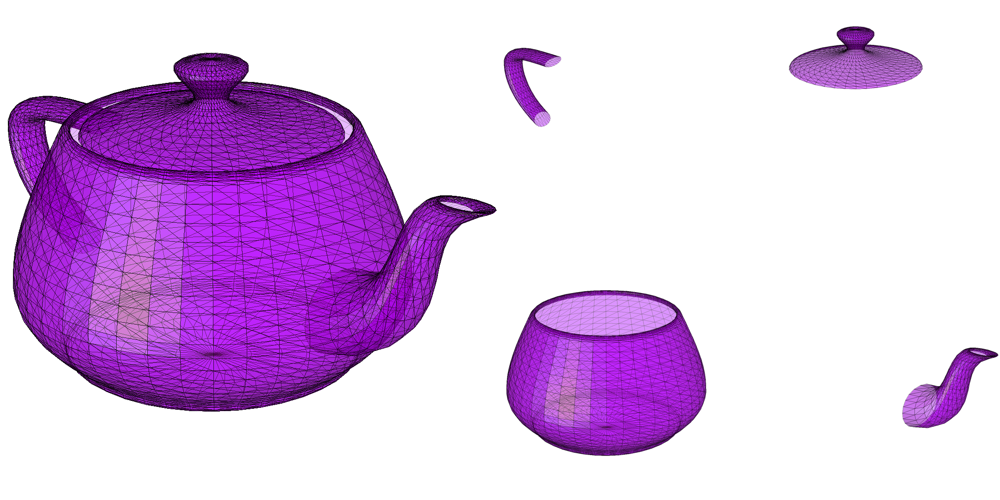

# Scientific computing

Example of a rendered mesh:



## Generating a mesh from a given parametrisation

The example given here will create a moebius strip. We'll demonstrate this using the following code:

```python
from maniflow.mesh.parameterized import *
from maniflow.mesh.obj import OBJFile


@VertexFunction
def moebius(vertex):
    x = vertex[0]
    y = vertex[1]
    x0 = np.cos(x) * (1 + (y / 2) * np.cos(x / 2))
    x1 = np.sin(x) * (1 + (y / 2) * np.cos(x / 2))
    x2 = (y / 2) * np.sin(x / 2)
    return np.array([x0, x1, x2])


u = Grid((0, 2 * np.pi), (-1, 1), 30, 10)  # create a high resolution grid
moebiusMesh = moebius(u)  # mapping the vertices from the grid according to the parametrisation
coincidingVertices(moebiusMesh) # remove the redundant vertices at the joint after making the moebius band
print(eulerCharacteristic(moebiusMesh)) # verify it is a real moebius band (expected value 0)
OBJFile.write(moebiusMesh, "moebius.obj")  # writing the mesh data to the file 'moebius.obj'
```
The .obj file created by this code can be loaded into :


## Getting started
To install the libarary, use

```
pip install maniflow-1.0-py2.py3-none-any.whl 
```

For builing the libarary one uses the command
```
python setup.py bdist_wheel --universal
```